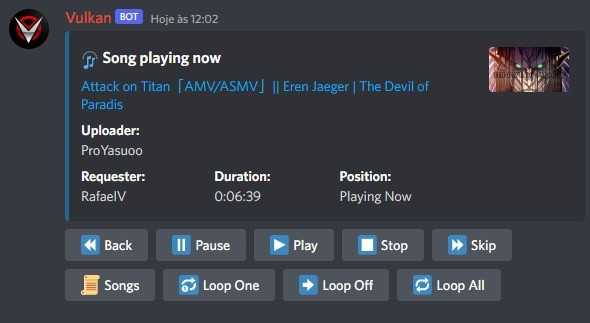
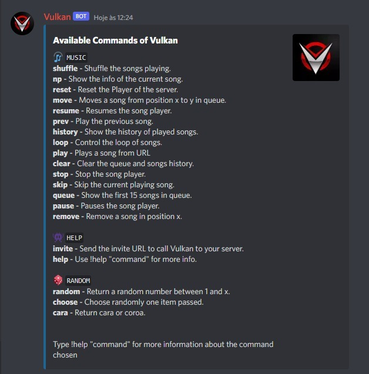
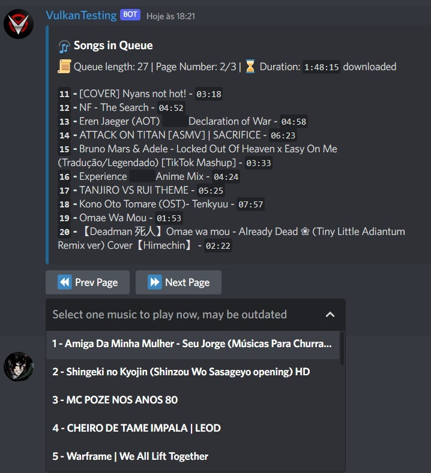

<h1 align="center">Vulkan</h1> 


A Music Discord Bot, that plays *Youtube*, *Spotify*, *Deezer* links or raw queries. Vulkan is open source, so everyone can fork this project, follow the instructions and use it in their own way, executing it in your own machine or hosting in others machines to work 24/7.

Vulkan uses multiprocessing and asynchronous Python modules to maximize Music Player response time, so the player doesn't lag when many commands are being processed and it can play in multiples discord serves at the same time without affecting the Music Player response time.


<p align="center">
  
</p>


#  **Music 🎧**
- Play musics from Youtube, Spotify and Deezer links (Albums, Artists, Playlists and Tracks).
- Play musics in multiple discord server at the same time.
- The player contains buttons to shortcut some commands. 
- Support for the new Discord Slash commands.
- Search for all musics in Queue using buttons.
- Shortcut the playing of one song using dropdown menu.
- Manage the volume of the songs.
- Manage the loop of one or all playing musics.
- Manage the order and remove musics from the queue.
- Shuffle the musics queue order.
- Automatically clean the sended messages so it doesn't fill up your server.


<p align="center">
  
</p>


<p align="center">
  
</p>


<hr>
<br>

## **Setting up for yourself** 


### **Requirements**
Installation of ``Python 3.10+`` and the dependencies in the requirements.txt file, creation of your own Bot in Discord and Spotify Keys. <br>
To install the dependencies type this command in the terminal, in the project root folder.
 
```
pip install -r requirements.txt
```
### **🔑 API Keys**
You have to create your own discord Bot and store your Bot Token 
 * Your Discord Application - [Discord](https://discord.com/developers)
 * You own Spotify Keys - [Spotify](https://developer.spotify.com/dashboard/applications)

    - This information must be stored in an .env file, explained further.

###  **Installation of FFMPEG**<br>
FFMPEG is a module that will be used to play music, you must have this configured in your machine
*FFMPEG must be configured in the PATH for Windows users. Check this [YoutubeVideo](https://www.youtube.com/watch?v=r1AtmY-RMyQ&t=114s&ab_channel=TroubleChute).* <br><br>
You can download the executables in this link `https://www.ffmpeg.org/download.html` and then put the .exe files inside a ffmpeg\bin folder in your C:\ folder. Do not forget to add 'ffmpeg\bin' to your PATH.


### **.Env File Example**
This is an example of how your .env file (located in root) should look like.
```env
BOT_TOKEN=Your_Own_Bot_Token
SPOTIFY_ID=Your_Own_Spotify_ID
SPOTIFY_SECRET=Your_Own_Spotify_Secret
BOT_PREFIX=Your_Wanted_Prefix_For_Vulkan
SHOULD_AUTO_DISCONNECT_WHEN_ALONE=True #all settings can be set like this
#etc... All settings can be set this way
```

### **⚙️ Configs**
The bot's configuration is stored in the [.env](.env) file, you can change the prefix and the bot token there, as well as all the other configurations.
Take a look in the [Settings page](.github/Docs/SETTINGS.md) to personalize the Bot for you.


### **Initialization**
- Go to [Discord](https://discord.com/developers) and invite your Bot to your own server
- Run ```python main.py``` in console to start
- Give this project a nice 🌟

### **🐳 Docker**
You can also run this project in a Docker container. You can find the instructions to run this project in a Docker container in the [Docker Instructions](.github/Docs/DOCKER.md) page.


<br>
<hr>
<br>


## **🚀 Heroku (Not free anymore)**
> *Heroku doesn't offer free host services anymore.* <br>

To deploy and run your Bot in Heroku 24/7, follow the instructions in the [Heroku Instructions](.github/Docs/HEROKU.md) page.

## 🧪 Tests
The tests were written manually with no package due to problems with async function in other packages, to execute them type in root: <br>
`python run_tests.py`<br>


## 📖 License
This program is free software: you can redistribute it and/or modify it under the terms of the [MIT License](https://github.com/RafaelSolVargas/Vulkan/blob/master/LICENSE).


## 🏗️ Contributing
  If you are interested in upgrading this project i will be very happy to receive a PR or Issue from you. See TODO project to see if i'm working in some feature now.  
